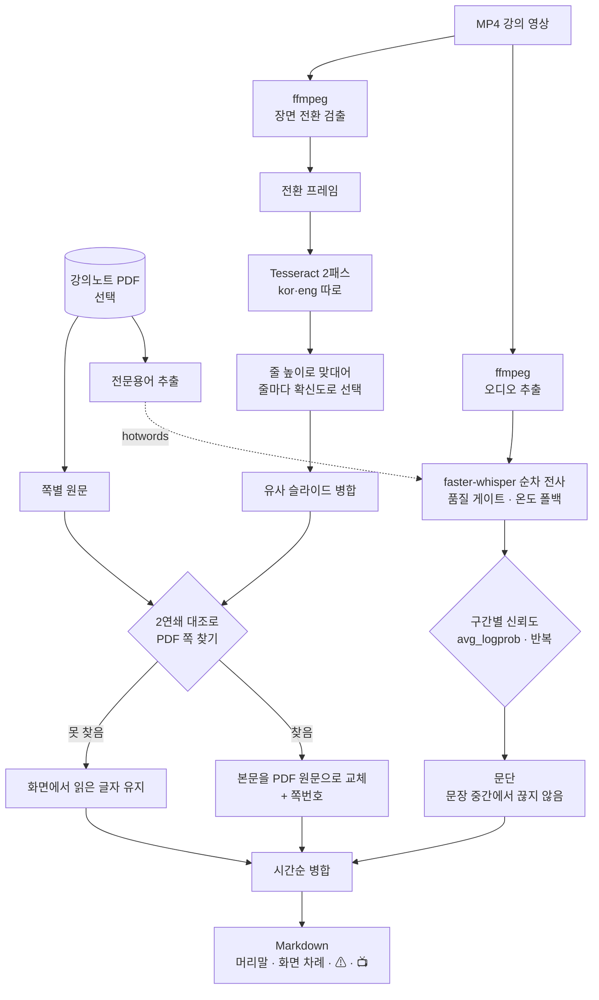

# lecture-transcriber

[](https://github.com/mijnch/lecture-transcriber/actions/workflows/tests.yml)
[](LICENSE)

> 녹화 강의(MP4)를 **LLM이 원본 그대로 이해할 수 있는 Markdown**으로 바꾸는 로컬 도구.
> 말소리뿐 아니라 화면의 슬라이드까지 읽어 시간순으로 엮고, **믿을 수 없는 대목에는 표식을 붙인다.**

| | |
|---|---|
| **입력 → 출력** | MP4(+강의노트 PDF) → 타임스탬프 Markdown |
| **동작 방식** | 전부 로컬 (faster-whisper · Tesseract · ffmpeg). 업로드 없음, 용량 제한 없음 |
| **처리 속도** | 1시간 영상당 27~43분 (슬라이드 읽기 포함) |
| **실적** | 9개 강의 318분 무인 처리, 실패 0 · 한글 슬라이드 3,160줄 중 **파손 0줄** |
| **검증** | 단위 검증 59개, 1초 내 완료 (산출물 생성 포함) |
| **설치** | `환경 설치.bat` 더블클릭 |

<details>
<summary><b>In English</b></summary>

A local pipeline that turns recorded university lectures into **LLM-readable Markdown**.

Plain speech-to-text loses two things: everything that was *on the screen*, and any signal about
which sentences can be trusted. ASR occasionally produces **fluent nonsense** that neither a human
nor an LLM can detect — quote it and you have invented a fact.

So this tool interleaves three channels in one document:

- **speech** — sequential faster-whisper decoding with quality gates and precise timestamps
- **screen** — scene-change detection → OCR, with per-line language selection
- **ground truth** — when the original lecture-note PDF is available, OCR is used only as a
  *key to identify which page is on screen*, and the body text is replaced with the PDF original

Every paragraph that the decoder was unsure about is marked `⚠`. Text that came from a video
played *during* the lecture — not from the professor — is marked `📺`. Slides backed by the PDF
carry a page number.

Runs fully offline on a laptop CPU (no CUDA required). Windows-first; Korean UI.
Every design decision below was settled by measurement, not preference.

</details>

---

## 어떻게 동작하나



## 산출물

*아래는 형식을 보이기 위한 가상 예시다.*

````markdown
---
과목: 표본통계학
주차: 7
교시: 2
---

## 화면 차례
- `[00:12:40]` · 18쪽 표본 크기와 신뢰구간

---

> **🖵 슬라이드 18쪽 [00:12:40 – 00:15:02]**
> 표본 크기와 신뢰구간
> - 표본이 커지면 신뢰구간은 좁아진다
> - 단, 편향은 표본 크기로 줄어들지 않는다

**[00:12:44]** 여기 보시면 표본이 커질수록 구간이 좁아지죠. 그런데...

**[00:31:07]** ⚠ 인식이 흔들린 문단입니다. 원문과 다를 수 있습니다.

**[00:38:22]** 📺 (교수의 말이 아니라 강의 중 재생된 영상의 말소리)
````

| 표식 | 뜻 |
|---|---|
| `🖵 슬라이드 N쪽` | 강의자료 PDF **원문 그대로**. 가장 믿을 수 있다 |
| `🖵 슬라이드` | 화면을 OCR로 읽은 것 |
| `📺` | 교수의 말이 **아니라** 재생된 영상 |
| `⚠` | 음성 인식이 흔들린 구간 |

## 설계에서 중요했던 판단

전부 **실측 A/B로 결정**했다. 인상이나 관행으로 정한 것은 없다.

### 1. OCR 언어를 섞지 않는다 — 한글 파손 22~50% → 0%

Tesseract에 `kor+eng`를 함께 주면 **굵은 한글이 영어 낱말로 오인**된다.

| 원문 | `kor+eng` | `kor` 단독 |
|---|---|---|
| 질문을 많이 하는 편이고 | **HAS** 많이 하는 편이고 | 질문을 ✅ |
| 당신과의 관계를 구축하기 | 당신과의 **AAS** 구축하기 | 관계를 ✅ |
| ㅇ 지원내용: 사업화 자금과 | ㅇ **AMY**: 사업화 자금과 | 지원내용 ✅ |

그래서 언어별로 따로 읽고 **줄 높이를 맞대어 줄마다 좋은 쪽을 고른다.**
점수는 길이가 아니라 **Tesseract 확신도**를 쓴다 — 길이로는 `A|| rights reserved`(깨진 쪽)가
정상 판본보다 한 글자 길어서 이기는 일이 실제로 있었다.

### 2. OCR을 "내용"이 아니라 "정합 열쇠"로 쓴다

강의자료 PDF가 있으면, 화면에서 읽은 글자는 **"지금 몇 쪽인가"를 알아내는 데만** 쓰고
본문은 PDF 원문으로 갈아끼운다. 잡음이 0이 되고 표의 열 구분과 빈칸이 보존된다.

대조는 낱말이 아니라 **글자 2연쇄(bigram)** 로 한다. 한국어 조사 변화(`벤처캐피탈` vs
`벤처캐피탈의`)와 OCR 잡음에 낱말 집합은 너무 약해서, 실측에서 임계 0.30에도 0.25밖에
나오지 않았다. 2연쇄로 바꾸니 깨진 OCR로도 정확히 맞춘다.

실측 정합률 — 3개 강의에서 **쪽 순서가 완벽하게 단조 진행**했다(교시별 시작 쪽까지 정확).

| 강의 | 확정률 | 쪽 순서 |
|---|---|---|
| 6-1 | 26/29 (90%) | 1 → 27 |
| 6-2 | 10/14 (71%) | 28 → 38 |
| 6-3 | 11/13 (85%) | 39 → 49 |

교시마다 되풀이되는 학습목표 쪽이 1교시 것으로 잘못 붙던 문제는, **강의는 앞에서 뒤로
진행한다**는 사실을 가중치로 넣어 해결했다.

### 3. 빠른 경로가 조용히 품질을 깎고 있었다

`BatchedInferencePipeline`은 `without_timestamps=True`가 기본이라 타임스탬프가
30초 단위로 뭉개지고, 품질 게이트(`compression_ratio` / `log_prob` / `no_speech`)와
온도 폴백이 **인자만 받고 버려진다**(라이브러리 docstring의 "Unused Arguments").

| | 배치 경로 | 순차 경로 |
|---|---|---|
| 속도 | 5.41× | 4.70× |
| 세그먼트 간격 | 26.6초 | **5.5초** |
| 한영 혼용 오염 | `기획의도` → `机会意度` | 없음 |

**13% 느린 대가로 타임스탬프 5배 정밀 + 오염 제거** → 순차 경로 채택.

### 4. 믿을 수 없는 구간을 산출물에 표시한다

`avg_logprob` / `no_speech_prob` 와 반복 패턴으로 흔들린 구간을 찾아 `⚠`를 붙인다.
화면 자막이 바로 옆 발화와 대부분 겹치면 **슬라이드가 아니라 재생된 영상**으로 보고
`📺`로 가른다 — 그러지 않으면 영상 속 인물의 자기소개가 교수의 경력으로 읽힌다.

## 실측 성능

Ryzen AI 5 435 (6C/12T), RAM 16GB, 내장 GPU (CUDA 불가 → CPU int8)

| 항목 | 값 |
|---|---|
| 처리 속도 | 1시간 영상당 **27~43분** (슬라이드 읽기 포함) |
| 슬라이드 읽기 끔 | 1시간당 13~15분 |
| 실적 | 9개 강의 318분 → 143분, 실패 0 |
| 한글 슬라이드 파손 | 3,160줄 중 **0줄** |

> 같은 작업을 두 번 돌려 143분과 228분이 나왔다. **동일 조건에서도 1.6배 차이**가 나므로
> 한 번 재고 단정하지 않는 편이 좋다.

## 검증

`engine/문단화_검증.py` — 전사 없이 **1초 만에 도는 단위 검증 59개.**
문단화·환각 표식·OCR 점수·슬라이드 병합·PDF 정합·자막 판정·산출물 지문을 다룬다.

**산출물 생성 자체도 검증한다.** 가짜 입력으로 `write_markdown`을 돌려 머리말·차례·
쪽번호·표식·마커 왕복을 확인하므로, 형식이 깨지는 회귀를 몇 시간짜리 전사 없이 잡는다.

```bash
engine\venv\Scripts\python engine\문단화_검증.py
```

## 찾아 고친 결함들

품질을 실제로 끌어올린 것은 기능 추가가 아니라 **조용히 나빠지던 것들을 찾아낸 일**이었다.

| 결함 | 증상 | 원인 |
|---|---|---|
| 정상 파일이 "손상"으로 거부 | 전사 자체가 실패 | 잘림 검사가 컨테이너(=영상) 길이와 대조. 끝에 무음 화면이 붙은 녹화가 걸림 → 오디오 스트림 길이로 변경 |
| 한 번 중단되면 그 파일이 영구 동결 | 이후 모든 실행이 "사용자가 편집함"으로 건너뜀 | 마커를 두 번 나눠 씀 + mtime 기반 판정 → 본문 SHA-256 1회 기록으로 변경 |
| Tesseract 실패가 "글자 없음"으로 위장 | 슬라이드 0장인 MD가 정상처럼 저장 | 반환코드 미검사 → 예외로 승격 |
| 흰 배경 텍스트 슬라이드 누락 | 44분 강의에서 **37분이 통째로 빠짐** | 장면 임계값이 너무 높음. 진단은 "슬라이드 공백"이 아니라 **타임스탬프가 안전 간격의 배수인 비율**로 해야 드러난다(53% vs 정상 1~3%) |
| 단위 테스트가 이름과 다른 것을 검증 | "문장 중간 절단 없음"이 실제로는 문단 길이만 확인 | 계산한 변수를 단정에 쓰지 않음 |
| 무인 실행이 조용히 멈춤 | 배터리로 돌리면 중간에 절전 | 절전 타이머는 CPU 부하가 아니라 **사용자 입력 유휴**를 본다 → `PowerSetRequest`로 차단 |
| 임시 파일 수백 MB가 폴더 밖에 잔류 | `%TEMP%`에 384MB 누적 | 강제 종료 시 정리 코드가 안 돎 → 작업 폴더를 도구 안(`.tmp/`)으로 옮기고 다음 실행이 회수 |

**교훈:** 속도만 재고 산출물 품질을 한 번도 세어보지 않은 것이 근본 실패였다.
"잘 되는 것 같다"는 인상으로 종결하지 말고 **산출물을 열어 세어볼 것.**
실제로 "잡음이 늘었다"고 판단했다가 전수로 세어보니 0.7%였던 적도 있다.

## 한계 (원리적으로 해결되지 않는 것)

- **도표의 관계** — 화살표 방향, 표의 열 구분은 글자가 아니라 남지 않는다. 낱말만 남는다.
- **강조** — 형광펜·굵은 글씨·판서는 사라진다. "여기 굵게 해놓은 것"이 무엇인지 알 수 없다.
- **한 줄에 두 언어가 섞인 경우** — 어느 판본을 골라도 반대쪽이 깨진다.
- **PDF 없이 OCR만 있을 때** — `장업단계`(창업), `벤저캐피탈`(벤처)처럼 **형태는 멀쩡한데
  글자가 틀린** 것은 기준 원본 없이 구별할 방법이 없다.

## 설치

**미리 있어야 하는 것**

| | 확인 |
|---|---|
| Windows 10/11 | |
| [Python 3.11+](https://www.python.org/downloads/) | 설치 시 **"Add python.exe to PATH"** 체크 |
| [ffmpeg](https://ffmpeg.org/download.html) | `winget install Gyan.FFmpeg` |
| [Tesseract OCR](https://github.com/UB-Mannheim/tesseract/wiki) | 슬라이드를 읽지 않을 거면 생략 가능 |

**설치**

`환경 설치.bat` 더블클릭. 한 번만 하면 된다.

- 폴더 안에 가상환경을 만들고 `engine/requirements.txt`를 잠긴 버전으로 설치한다
- 슬라이드 OCR 언어 데이터(`kor`·`eng`, 16MB)를 릴리스에서 받아 `engine/tessdata/`에 푼다
- 끝에 무엇이 준비됐고 무엇이 빠졌는지 점검해 알려 준다

음성 인식 모델(1.6GB)은 **첫 실행 때 자동으로** 내려받는다.

**실행**

```
MP4 입력/          ← 강의 영상을 넣는다 (하위 폴더 가능)
강의자료 PDF/       ← 강의노트 PDF (선택, 권장)
```

`Transcriber 실행.bat` 더블클릭 → `MD 출력/`에 결과.
설정은 [`설정.ini`](설정.ini), 자세한 사용법은 [사용법.md](사용법.md),
결과물을 LLM에 넣을 때의 안내는 [CLAUDE.md](CLAUDE.md).

## 구조

```
Transcriber 실행.bat      실행 진입점
환경 설치.bat             최초 1회 설치
설정.ini                  사용자 설정
engine/transcribe.py      엔진 전체 (설정·전사·OCR·PDF 정합·출력)  ~1,490줄
engine/문단화_검증.py       단위 검증 59개
engine/setup_env.py       가상환경 생성 · 의존성 · 언어 데이터 · 점검
engine/requirements.txt   버전 잠금
```

**폴더 밖을 더럽히지 않는다.** 가상환경·모델·언어 데이터·임시 파일이 전부 도구 폴더 안에
생기므로, 폴더를 통째로 지우면 흔적이 남지 않는다.

산출물 끝에는 `<!-- transcriber: {...} -->` 마커가 붙는다. 다시 변환할지는 파일 날짜가
아니라 이 마커로 판정하므로, **설정·강의자료·엔진이 바뀌면 자동으로 다시 만들고
사용자가 손댄 결과물은 보존**한다.

---

이 저장소에는 **코드만** 있다. 강의 영상·전사문·강의자료는 대학 저작물이며
인터넷 배포가 금지되어 있어 포함하지 않는다.

MIT License
