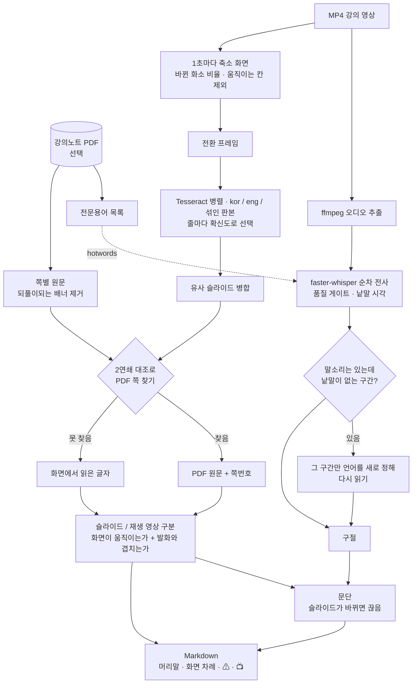

# lecture-transcriber

[](https://github.com/mijnch/lecture-transcriber/actions/workflows/tests.yml)
[](LICENSE)


> 녹화 강의(MP4)를 **LLM이 원본 그대로 이해할 수 있는 Markdown**으로 바꾸는 로컬 도구.
> 말소리뿐 아니라 화면의 슬라이드까지 읽어 시간순으로 엮고, **믿을 수 없는 대목에는 표식을 붙인다.**

| | |
|---|---|
| **입력 → 출력** | MP4(+강의노트 PDF) → 타임스탬프 Markdown |
| **동작 방식** | 전부 로컬 (faster-whisper · Tesseract · ffmpeg). 업로드 없음, 용량 제한 없음 |
| **온디바이스 추론** | 노트북 CPU만으로 (CUDA 없음) — 기본 모델 Whisper large-v3-turbo를 CTranslate2 **int8**로, 화면 OCR은 논리 코어 수만큼 병렬로 (12스레드에서 **5.8배**, 출력 바이트 단위 동일) |
| **슬라이드 포착** | 합성 강의 48장 중 **48장, 실제 전환 시각 ±1초** (이전 판 39장) · 실강의 쪽 전환 **26/26** |
| **처리 속도** | 실강의 1시간당 평균 약 23분 (한국어 강의 16~17분, 외국어 영상이 많은 강의 35분) |
| **검증** | 단위 검증 152개 + 합성 강의 2편 종단 검증 47항목 + 실강의 3편(좌우 분할·전체 화면·겹침 구성) |
| **실적** | 이전 판으로 실강의 9개 318분 무인 처리, 한글 슬라이드 3,160줄 중 **파손 0줄** |
| **설치** | `환경 설치.bat` 더블클릭 |

<details>
<summary><b>In English</b></summary>

A local pipeline that turns recorded university lectures into **LLM-readable Markdown**.

Plain speech-to-text loses two things: everything that was *on the screen*, and any signal about
which sentences can be trusted. ASR occasionally produces **fluent nonsense** — or silently drops
a passage spoken in another language — and neither a human nor an LLM can tell from the text.

So this tool interleaves three channels in one document:

- **speech** — sequential faster-whisper decoding with quality gates and word timestamps; spans
  where the VAD hears speech but no words came out are re-transcribed with fresh language detection
- **screen** — slide changes found by *changed-pixel ratio* against the last kept frame, with
  constantly moving regions (speaker cam, embedded video) learned and masked out; parallel OCR
  in Korean, English and mixed modes with per-line selection; lines cut off by a speaker standing
  over the slide are re-read from a frame where only the speaker is painted out
- **ground truth** — when the lecture-note PDF is available, OCR is used only as a *key to find
  which page is on screen*, and the body text is replaced with the PDF original

Paragraphs break where the slide changes, so each explanation sits under the slide it refers to.
Unsure paragraphs are marked `⚠`; audio from a video played *during* the lecture is marked `📺`.

Runs fully offline on a laptop CPU (no CUDA): Whisper large-v3-turbo on CTranslate2 int8 by default, and
slide OCR fanned out across all logical cores (5.8× faster on 12 threads, byte-identical output). Windows-first; Korean UI.
Every design decision below was settled by measurement, and an end-to-end test builds a synthetic
lecture with known answers (rendered slides, TTS narration, a played video clip) and grades the output.

</details>

---

## 어떻게 동작하나


```mermaid
flowchart TD
    MP4[MP4 강의 영상] --> A[ffmpeg 오디오 추출]
    MP4 --> S[1초마다 축소 화면<br/>바뀐 화소 비율 · 움직이는 칸 제외]
    PDF[(강의노트 PDF<br/>선택)] --> H[전문용어 목록]
    PDF --> P[쪽별 원문<br/>되풀이되는 배너 제거]

    H -.hotwords.-> W
    A --> W[faster-whisper 순차 전사<br/>품질 게이트 · 낱말 시각]
    W --> G{말소리는 있는데<br/>낱말이 없는 구간?}
    G -->|있음| R[그 구간만 언어를 새로 정해<br/>다시 읽기]
    G --> PH[구절]
    R --> PH

    S --> F[전환 프레임]
    F --> O[Tesseract 병렬 · kor / eng / 섞인 판본<br/>줄마다 확신도로 선택]
    O --> M[유사 슬라이드 병합]
    M --> AL{2연쇄 대조로<br/>PDF 쪽 찾기}
    P --> AL
    AL -->|찾음| REP[PDF 원문 + 쪽번호]
    AL -->|못 찾음| KEEP[화면에서 읽은 글자]
    REP --> LB[슬라이드 / 재생 영상 구분<br/>화면이 움직이는가 + 발화와 겹치는가]
    KEEP --> LB

    PH --> PARA[문단<br/>슬라이드가 바뀌면 끊음]
    LB --> PARA
    PARA --> MD[Markdown<br/>머리말 · 화면 차례 · ⚠ · 📺]
    LB --> MD
```

## 산출물

*아래는 형식을 보이기 위한 가상 예시다.*

````markdown
---
과목: 표본통계학
주차: 7
교시: 2
---

## 화면 차례
- `[00:12:40]` · 18쪽 표본 크기와 신뢰구간

---

> **🖵 슬라이드 18쪽 [00:12:40 – 00:15:02]**
> 표본 크기와 신뢰구간
> - 표본이 커지면 신뢰구간은 좁아진다
> - 단, 편향은 표본 크기로 줄어들지 않는다

**[00:12:44]** 여기 보시면 표본이 커질수록 구간이 좁아지죠. 그런데...

**[00:31:07]** ⚠ 인식이 흔들린 문단입니다. 원문과 다를 수 있습니다.

> **📺 영상 자막 [00:38:20 – 00:39:05]**

**[00:38:22]** 📺 (교수의 말이 아니라 강의 중 재생된 영상의 말소리)
````

| 표식 | 뜻 |
|---|---|
| `🖵 슬라이드 N쪽` | 강의자료 PDF **원문 그대로**. 가장 믿을 수 있다 |
| `🖵 슬라이드` | 화면을 OCR로 읽은 것 |
| `📺` | 교수의 말이 **아니라** 재생된 영상 |
| `⚠` | 음성 인식이 흔들린 구간, 또는 말소리가 있었지만 옮기지 못한 구간 |

## 설계에서 중요했던 판단

전부 **실측 A/B로 결정**했다. 인상이나 관행으로 정한 것은 없다.

### 1. OCR 언어는 따로 읽고, 줄마다 고른다 — 한글 파손 22~50% → 0%

Tesseract에 `kor+eng`를 함께 주면 **굵은 한글이 영어 낱말로 오인**된다.

| 원문 | `kor+eng` | `kor` 단독 |
|---|---|---|
| 질문을 | **HAS** | 질문을 ✅ |
| 관계를 | **AAS** | 관계를 ✅ |
| 지원내용 | **AMY** | 지원내용 ✅ |

그래서 언어별로 따로 읽고 **줄 높이를 맞대어 줄마다 좋은 쪽을 고른다.**
점수는 길이가 아니라 **Tesseract 확신도**를 쓴다 — 길이로는 `A|| rights reserved`(깨진 쪽)가
정상 판본보다 한 글자 길어서 이기는 일이 실제로 있었다.

그런데 **한 줄에 두 언어가 섞이면** 단독 판본은 어느 쪽이든 반대 언어를 깨뜨린다. 한국어
슬라이드의 영어 용어가 숫자 더미가 되고, 영어 슬라이드의 한국 이름이 기호가 됐다(실강의).

*합성 슬라이드(가상 자료)로 잰 결과:*

| 원문 | `kor`·`eng` 중 고른 줄 | 섞인 판본까지 넣고 고른 줄 |
|---|---|---|
| Anchors: Reporter 김가상, Announcer 이가상 | Reporter 27t¢, Announcer 0\|7}¢ | Reporter **김가상**, Announcer **이가상** ✅ |
| Source: 가상일보 (2024.3.2) | Source: 7F2$2 4! (2024.3.2) | Source: **가상일보** (2024.3.2) ✅ |
| 최소표본크기(Minimum Sample Size)를 | (\\/10107410 58001 5120)를 | (\\/10107410 **Sample** 5120)를 — 일부만 |
| 표집틀(Sampling Frame)은 | (630710!109 「「2106)은 | 그대로 깨짐 |

그래서 섞인 판본을 **세 번째 후보**로 함께 읽는다. 굵은 한글을 라틴으로 오인한 줄은 글자종
섞임 벌점으로 떨어지므로 위의 파손은 돌아오지 않는다. 실강의에서 강의자료 PDF를 정답으로 두고
잰 재현율이 0.875 → 0.894로 올랐고, 영어 강의에서는 한국 이름·용어가 든 줄 8개가 살아났다.
다만 위 표처럼 **한글 줄의 괄호 속 영어는 여전히 자주 깨진다** — PDF가 없으면 남는 한계다.
OCR 시간은 늘지만 음성 전사와 견주면 작다.

### 2. OCR을 "내용"이 아니라 "정합 열쇠"로 쓴다

강의자료 PDF가 있으면, 화면에서 읽은 글자는 **"지금 몇 쪽인가"를 알아내는 데만** 쓰고
본문은 PDF 원문으로 갈아끼운다. 잡음이 0이 되고, OCR이 제목만 겨우 읽는 표 슬라이드도
표의 행까지 원문으로 실린다.

대조는 낱말이 아니라 **글자 2연쇄(bigram)** 로 한다. 한국어 조사 변화(`표본` vs
`표본의`)와 OCR 잡음에 낱말 집합은 너무 약해서, 실측에서 임계 0.30에도 0.25밖에
나오지 않았다. 2연쇄로 바꾸니 깨진 OCR로도 정확히 맞춘다. 실강의 3편에서 **쪽 순서가
완벽하게 단조 진행**했다(90% / 71% / 85% 확정, 교시별 시작 쪽까지 정확).

### 3. 화면 전환은 "평균 차이"가 아니라 "바뀐 화소의 비율"로 찾는다

ffmpeg의 `scene` 점수는 화면 전체의 평균 차이라서, 흰 바탕에 글자만 바뀌는 전환은
임계 0.03으로도 못 잡는다. 합성 강의에서 **전환 8번 중 1번만** 잡혔고, 나머지는 30초 안전
샘플에 걸려 최대 20초 늦게 찍혔으며 **짧게 지나간 슬라이드 2장은 통째로 빠졌다.**

| 척도 (320×240 회색, 밝기 차 >24) | 글자 한 줄이 늘어난 전환 | 정지 화면 |
|---|---|---|
| 바뀐 화소 비율 | **0.45%** | **0.000%** |

그래서 1초마다 축소 화면을 받아 **마지막으로 고른 화면과** 견준다(조금씩 쌓이는 판서도 잡힌다).
화자 창·화면 속 동영상처럼 **계속 움직이는 칸은 스스로 알아내 비교에서 뺀다.** 안전 샘플이 필요
없어졌고, 16.6분 합성 강의에서 슬라이드 48장을 전부 ±1초로 잡았다(이전 판 39장).

**실강의 검증** — 44분 강의에서 10초 간격으로 화면을 읽어 강의자료 쪽에 맞춘 기준선을 만들고
견주었다. 기준선의 **쪽 전환 26번을 모두** 잡았고 27개 쪽을 빠짐없이 찾았다. 다만 화자가 가끔씩
움직일 때마다 화면을 골라(331장, 절반이 화자 쪽 변화) 좌측 슬라이드 영역 기준을 함께 추적하게
했다 — 184장으로 줄고 전환은 여전히 26/26.

화자가 어디 있는지는 **슬라이드 쪽이 멈춘 동안** 오른쪽이 움직이는지로 판단한다. 세 실강의가
전부 구성이 달랐다 — 좌우 분할, 슬라이드 전체 화면, 교수가 슬라이드 위에 겹쳐 선 화면.
"오른쪽이 한 번이라도 움직였나"로 보면 전체 화면 슬라이드에서 영상을 틀 때 참이 되어
**모든 슬라이드의 오른쪽 3분의 1을 잘라 버렸고**, 전체 시간의 좌우 비율로 보면 영상을 19분 튼
좌우 분할 강의에서 화자를 놓쳤다. 영상 시간을 빼면 화자 있음 0.23·0.25, 없음 0.001로 갈린다.

교수가 슬라이드 위에 겹쳐 선 강의는 좌측만 잘라 읽으면 **화자 머리 위를 지나는 긴 줄의 끝이
잘렸다**(마지막 낱말이 반쯤 잘린 줄이 쪽마다). 두 가지 대안이 모두 실측에서 졌다 — 화면 전체를 읽으면 어두운
제목 띠가 오른쪽 로고와 한 줄로 묶여 **제목이 통째로 사라지고**, 잘라 읽은 판본과 넓게 읽은
판본을 줄 높이로 섞으면 같은 줄이 두 번 들어가 정확도가 0.87 → 0.82로 떨어졌다. 그래서
**잘린 가장자리에 닿은 줄만**, 슬라이드가 멈춘 동안 움직인 칸(= 화자 자리)만 가린 넓은 화면을
한 번 더 읽어 그 줄로 시작하는 더 긴 줄로 바꾼다. 가장자리에 닿지 않은 줄에는 로고·화자 조각이
붙지 않고, 끊긴 줄이 없는 화면은 한 번만 읽는다.

화면을 고른 패스와 읽는 패스가 같은 프레임을 가리켜야 한다 — `fps=1`의 기본 반올림은
n+0.5초 근처 프레임을 줘서, 전환을 잡고도 **전환 직전 화면을 읽어 슬라이드가 한 장씩 밀렸다.**
`round=up`으로 바꿔 16곳 모두 화소 차이 0을 확인했다.

### 4. 빠른 경로가 조용히 품질을 깎고 있었다 — 그래서 없앴다

`BatchedInferencePipeline`은 `without_timestamps=True`가 기본이라 타임스탬프가
30초 단위로 뭉개지고, 품질 게이트(`compression_ratio` / `log_prob` / `no_speech`)와
온도 폴백이 **인자만 받고 버려진다**(라이브러리 docstring의 "Unused Arguments").

| | 배치 경로 | 순차 경로 |
|---|---|---|
| 속도 | 5.41× | 4.70× |
| 세그먼트 간격 | 26.6초 | **5.5초** |
| 한영 혼용 오염 | `기획의도` → `机会意度` | 없음 |

한때 `우선순위 = 속도` 설정으로 남겨 두었으나, 전사만 15% 빠른 대가로 슬라이드와 말의
시간 정렬을 깨는 경로라 이 도구의 목적과 맞지 않아 제거했다.

### 5. 한 언어로 읽으면 다른 언어 대목이 오류 없이 사라진다

파일 전체를 `ko`로 읽으면, 한국어 강의 속 20초짜리 영어 설명이 **31초짜리 세그먼트에 한국어
한 문장만 남기고 통째로 빠진다.** 표식도, 오류도 없다. 구간별 언어 감지(`multilingual`)로도
복구되지 않았다(실측).

그래서 낱말 시각을 켜고(비용 2.5%), VAD가 말소리라고 한 곳 가운데 **낱말이 하나도 없는
3초 이상 구간**을 찾아 그 구간만 언어를 새로 정해 다시 읽는다. 한 번에 약 10초가 들고,
합성 강의에서 빠진 영어 설명을 원문과 똑같이 되살렸다. 다시 읽어도 못 옮긴 긴 구간은
본문에 `⚠`로 남긴다 — **조용한 누락을 드러난 누락으로 바꾼다.**

반대 방향은 더 교묘했다. 실강의(영어 강의 속 한국어 뉴스 영상)에서는 한국어 말소리가
빠지지 않고 **그럴듯한 영어 환각 문장으로 9분간 채워졌다.** 빈틈이 없으니 위 장치가 못 잡는다.
다만 `⚠`는 붙어 있었으므로, **`⚠`가 이어진 구간도 언어를 새로 정해 다시 읽고** 다른 언어로
확신 있게(감지 확률 0.7 이상, 대부분 `⚠` 아님) 읽힐 때만 갈아끼운다. 같은 언어로 나오면 진짜
음질 문제이므로 `⚠`를 그대로 둔다. 실제 2분 구간에서 `⚠` 23개가 0~1개로 줄고 한국어 원문이 살아났다.

### 6. 믿을 수 없는 구간과 다른 화자를 표시한다

`avg_logprob` / `no_speech_prob` 와 반복 패턴으로 흔들린 구간을 찾아 `⚠`를 붙인다.
화면 글자가 바로 옆 발화와 겹치고 **그때 화면이 움직이고 있으면** 재생된 영상의 자막으로 보고
`📺`로 가른다. 움직임 조건이 없던 판은 교수가 제목 슬라이드를 소리 내 읽기만 해도 자막으로
오판했다. 영상 구간의 끝은 다음 화면이 뜬 시각이라, 영상 직후 교수의 말은 `📺`에서 빠진다.

자막이 없는 영상(뉴스 화면)은 글자로는 못 찾는다. 그래서 **말의 언어가 교수와 다르게 다시
읽혔고 그동안 슬라이드 쪽이 움직였으면** 재생 영상으로 본다. 그런 구간이 1분 이내로 이어지고
사이에도 화면이 움직였으면 한 영상으로 잇는다 — 그 사이에는 영상 속 노래나, 교수의 언어로
'번역'되어 `⚠` 없이 남은 말이 있어서, 이어 주지 않으면 교수의 말로 읽힌다. 영어 강의에서 튼
영어 인터뷰처럼 말의 언어가 같고 출처 주소도 없으면, **움직이는 화면의 짧은 글자가 강의 언어와
다른 문자(한글 자막)인지**를 본다. 그런 영상 안에 남은 `⚠`는 자동 판별 대신 **영상의 언어로
고정해** 다시 읽는다 — 음악이 깔린 짧은 조각은 교수의 언어로 판별되어 재독이 버려졌었다.

영상의 **경계**도 실측으로 다듬었다. 영상이 끝나며 슬라이드로 2초 동안 서서히 바뀌면 그 1초가
'움직이는 화면'의 평균에 들어가, 뒤 슬라이드와 그 설명 42초가 영상으로 묶였다 — 평균 대신
중앙값을 쓰고, 구간 끝에 뜬 뒤 거의 움직이지 않은(판서·커서 정도) 화면은 떼어 낸다. 영상이 끝나
마지막 화면이 멈춘 채 다음 슬라이드가 몇 초 뒤에 뜨는 경우도 멈춘 때에서 끊는다. 시작 쪽은
커서·슬라이드 넘김이 아니라 **영상다운 움직임**(0.08 이상이 5초 중 4초)이 시작된 초로 잡는다.
교수가 말을 마치자마자 영상이 시작되면 쉼 없이 한 구절로 묶여 영상의 첫마디가 교수의 말로
실렸다 — 영상의 시작·끝에서 구절을 나누고, 끝에는 여유를 두지 않는다.

## 실측 성능

Ryzen AI 5 435 (6C/12T), RAM 16GB, 내장 GPU (CUDA 불가 → CPU int8)

| 항목 | 값 |
|---|---|
| OCR 병렬화 | 동시 12개로 **5.8배**, 출력은 바이트 단위로 동일 |
| 슬라이드 처리 (16.6분 합성 강의) | 62.9초 → **32.3초**, 더 많은 전환을 잡고도 |
| 전사 속도 | 실시간 대비 약 4~5배 |
| 실강의 3편 150분 전체 | **58.8분** — 1시간당 평균 23.5분(15.9 · 17.3 · 34.9분). 앞 판 51.9분, 그 전 판 27~43분 |
| 화면 읽기 (그중) | 2분 04초 · 2분 46초 · 6분 36초 — 섞인 판본·잘린 줄 이어 읽기·긴 슬라이드 두 번 읽기로 강의당 1~2.5분 늘었다. 영상 재생 중 화면에까지 적용하던 첫 판은 6분 36초 자리가 10분 26초였다 |

> 같은 작업을 두 번 돌려 143분과 228분이 나온 적이 있다. **동일 조건에서도 1.6배 차이**가
> 나므로 한 번 재고 단정하지 않는 편이 좋다. 빠진 말소리나 다른 언어 대목을 다시 읽는 데 한 곳당
> 약 10초가 더 든다 — 위 34.9분짜리가 영어 강의 속 한국어 영상이 많아 48곳을 다시 읽은 경우다.

## 검증

```bash
engine\venv\Scripts\python engine\문단화_검증.py
```

**단위 검증 152개**, 몇 초 안에 끝난다. 문단화·빠진 구간 찾기·화면 전환 검출·OCR 점수·
잘린 줄 이어 읽기·슬라이드 병합·PDF 정합·자막 구분·영상 경계·끌어다 놓기·산출물 형식을
다룬다(다시 읽기는 가짜 모델로 확인한다). 가짜 입력으로
`write_markdown`까지 돌려 머리말·차례·쪽번호·표식·마커 왕복을 확인한다. CI가 매 push마다
Windows·Python 3.14에서 돌리고, 잠긴 의존성이 설치 가능한지도 확인한다.

```bash
engine\venv\Scripts\python engine\종단_검증.py
```

**종단 검증** — 단위 검증으로는 단계 사이의 결함을 못 잡는다. 이 스크립트는 정답을 아는
합성 강의 두 편을 만들어 엔진을 끝까지 돌리고 **47개 항목**을 채점한다. 약 5분.

- **A** (3분) — 화자 창이 따로 있는 화면. Edge로 그린 슬라이드 9장, 음성 합성 나레이션, 한국어
  강의 속 영어 설명, 재생 영상 셋(번인 자막이 있고 끝나며 다음 슬라이드로 서서히 바뀌는 영상,
  자막 없이 교수와 같은 언어로 말하고 출처 주소만 있는 인터뷰, 자막 없는 영어 영상), 이름에
  과목이 없는 LMS 묶음(zip) 속 강의노트 PDF
- **B** (1분 20초) — 화자가 슬라이드 위에 겹쳐 선 화면. 화자 위를 지나 경계 밖까지 뻗는 긴 줄,
  어두운 띠 위의 흰 제목, 영어 줄 속 한국 이름, 같은 주차지만 다른 과목인 A의 자료

모든 쪽이 순서대로 한 번씩, 전환 시각 ±1.5초(영상 직후 슬라이드 포함), 세 영상 모두 찾기와 그 경계,
영상 직후 교수의 첫마디에 `📺` 없음, 설명이 제 슬라이드 밑에, 잘린 줄이 끝까지 이어졌는지,
화자 영역·로고를 글자로 읽지 않았는지, 다른 과목 자료를 쓰지 않았는지 등을 본다.
아래 표의 끝부분 가운데 여덟 가지(두 영상 사이 슬라이드, 자르기 판단, 버려지던 자막, 가림 색,
두 음절 제목, 외국어 구간의 끝, 영상 직후 슬라이드 시각, 무늬 잡음 자막)는 실강의가 아니라 이
검증을 늘리면서 드러났다 — 그중 둘은 한 번은 통과하고 한 번은 실패해서, 연달아 두 번 돌려서야 보였다.

## 찾아 고친 결함들

품질을 실제로 끌어올린 것은 기능 추가가 아니라 **조용히 나빠지던 것들을 찾아낸 일**이었다.

| 결함 | 증상 | 원인 |
|---|---|---|
| 슬라이드 누락·지연 | 전환 8번 중 1번만 검출, 2장 통째로 누락, 최대 20초 늦음 | 평균 차이(`scene`)는 글자 변화에 둔감 → 바뀐 화소 비율 + 움직이는 칸 제외 |
| 슬라이드가 한 장씩 밀림 | 전환을 잡고도 전환 직전 화면을 읽음 | 고르는 패스(`fps` 반올림)와 읽는 패스(`-ss`)가 다른 프레임 → `round=up` |
| 다른 언어 대목 소실 | 영어 설명 22초가 오류 없이 사라짐 | 파일 단위 언어 고정 → 낱말 없는 말소리 구간을 찾아 다시 읽기 |
| 전문용어 힌트의 부작용 | 세그먼트 24개 → 7개, 문장부호 25개 → 5개 | PDF 문장이 그대로 프롬프트가 됨 → 쉼표로 나열한 용어 목록 |
| 제목 슬라이드가 `📺` | 교수가 제목을 읽기만 해도 "재생된 영상" | 글자 겹침만 봄 → 화면이 움직일 때만 자막 |
| 영상 직후 교수 말이 `📺` | "영상에서 보셨듯이…"가 교수의 말이 아니라고 표시 | 앞뒤 15초 여유 → 영상 끝을 다음 화면 시각으로 확정 |
| 영역 판정 오류 | 화자 쪽 무늬를 글자로 읽어 슬라이드를 자르지 않음 | 읽힌 줄 수만 셈 → 깨진 줄 감점 + 오른쪽이 움직이는지 확인 |
| 병렬화가 음성 인식을 망침 | 40초 처리에 111초, 한국어를 `en`으로 오판, "Or or or" | `OMP_THREAD_LIMIT=1`을 프로세스 전역에 걸어 CTranslate2까지 1스레드 → Tesseract에만 전달 |
| 정상 파일이 "손상"으로 거부 | 전사 자체가 실패 | 잘림 검사가 컨테이너(=영상) 길이와 대조 → 오디오 스트림 길이로 |
| 한 번 중단되면 그 파일이 영구 동결 | 이후 모든 실행이 "사용자가 편집함"으로 건너뜀 | 마커를 두 번 나눠 씀 + mtime 판정 → 본문 SHA-256 1회 기록 |
| Tesseract 실패가 "글자 없음"으로 위장 | 슬라이드 0장인 MD가 정상처럼 저장 | 반환코드 미검사 → 예외로 승격 |
| 단위 테스트가 이름과 다른 것을 검증 | "문장 중간 절단 없음"이 실제로는 문단 길이만 확인 | 계산한 변수를 단정에 쓰지 않음 |
| 무인 실행이 조용히 멈춤 | 배터리로 돌리면 중간에 절전 | 절전 타이머는 **사용자 입력 유휴**를 본다 → `PowerSetRequest` |
| 끌어다 놓은 파일 대신 다른 파일 전사 | 입력 폴더에 이름만 같은 파일이 있으면 그걸 처리 | 이름만 확인 → 같은 파일인지(`samefile`) 확인 |
| 다른 언어 대목이 환각으로 채워짐 | 영어 강의 속 한국어 영상 9분이 영어 헛문장으로, `📺`도 안 붙음 | 빈틈만 다시 읽음 → `⚠` 구간도 언어를 새로 정해 다시 읽고, 언어+움직임으로 영상 판정 |
| LMS 강의자료가 안 쓰임 | ZIP 그대로, 이름에 과목명 없음(`6주차교재.pdf`) | `.pdf`·이름 일치만 봄 → ZIP 안까지, 주차가 같으면 후보로 두고 **화면과 맞춰 본 뒤** 채택 |
| 화자가 움직일 때마다 화면을 고름 | 실강의 44분에 331장(쪽은 27개), 절반이 화자 쪽 변화 | 가끔 움직이는 칸은 '계속 움직임'으로 안 걸러짐 → 좌측 영역 기준을 함께 추적, 184장·전환 26/26 유지 |
| 슬라이드 오른쪽이 잘림 | 전체 화면 슬라이드 강의에서 모든 쪽의 오른쪽 3분의 1이 사라짐 | 전체 화면 영상 재생을 화자로 오인 + 줄 수로 비교(잘린 줄도 한 줄) → 슬라이드가 멈춘 동안의 좌우 움직임으로 화자 판정, 오른쪽 띠를 따로 읽어 자르기 판단 |
| 영상 내레이션이 교수의 말로 | 설명 영상 속 정지 글자 카드에서 영상 구간이 5조각으로 끊김 | 틈이 30초 이내이거나 그 사이 화면이 빠르게 바뀌면(카드) 잇되, 강의자료 쪽이 뜨거나 교수 언어의 논평이 있으면 잇지 않음 |
| 인터뷰 영상이 교수의 말로 | 자막도 언어 차이도 없는 영상 72초 | 슬라이드 쪽이 오래·크게 움직이고(94초 중 73초, 보통 슬라이드는 70초 중 1초) 영상 출처 주소가 보이면 영상. 판서는 움직임이 작고, 카메라만 비추는 강의는 제외 |
| 그림 슬라이드의 OCR 잡음 | 사진·로고 화면에서 `NW` 같은 조각이 본문에 | 글자 3자 미만에 숫자도 없는 줄은 뺀다(숫자만 있는 줄은 표일 수 있어 남긴다). 표 괘선을 읽은 `1 \| \| \| 1. \|` 같은 줄도 뺀다 |
| 영상 뒤 슬라이드가 `📺`로 | 영상이 슬라이드로 서서히 바뀌면 그 슬라이드와 교수 설명 42초가 영상으로 | 전환 2초 중 1초가 '움직이는 화면' 평균에 들어감 → 중앙값, 구간 끝의 멈춘 화면·강의자료 쪽은 뗌 |
| 영상 경계의 말이 반대편으로 | 교수의 마지막 말과 영상 첫마디가 한 구절, 끝 0.5초 여유로 교수 첫마디가 `📺` | 쉼 없이 이어지면 한 구절 → 영상 시작·끝에서 구절을 나눔, 끝 여유 제거 |
| 두 영상 사이 교수 슬라이드가 `📺` | 7초 뜬 교수 슬라이드와 설명, 영상 앞 슬라이드를 넘긴 순간까지 영상으로 | 20초 창을 밀며 봄 → 움직임이 이어진 구간(4초 이하 멈춤만 이음)으로 |
| 겹친 화자 강의의 줄 끝 잘림 | 화자 위를 지나는 긴 줄의 마지막 낱말이 쪽마다 잘림 | 좌측만 읽음 → 가장자리에 닿은 줄만, 화자를 배경색으로 가린 넓은 화면에서 뒤꼬리를 이어 읽음 |
| 한 줄에 섞인 반대 언어 파손 | 영어 줄 속 한국 이름이 기호로, 한글 줄 속 영어 용어가 숫자로 | 언어별 단독 판본만 읽음 → 섞인 판본을 세 번째 후보로, 섞임 벌점 12→6(정답 PDF 대비 정확도 동일) |
| 자르기 판단이 표본 운에 좌우 | 표본 화면 3장이 영상·표에 걸리면 화자 영역까지 읽음 | 길이의 25·50·75% 지점 → 멈춘 슬라이드 5장, 띠에서 되풀이되는 로고는 세지 않음 |
| 멀쩡한 자막을 통째로 버림 | 자막 끝 기호 조각 하나로 줄이 사라져 영상을 놓침 | 제목용 '깨진 줄' 판정을 그대로 씀 → 잡음 조각만 뗌 |
| 두 음절 제목이 잡음으로 | `정리`·`목차` 같은 제목이 사라짐 | 글자 3자 미만을 잡음으로 봄 → 한글 두 음절은 남김 |
| 외국어 영상 직후 교수 첫마디가 `📺` | 영어 세그먼트 하나가 교수의 한국어 첫 낱말까지 품음 | 다른 언어 구간을 세그먼트로 잡음 → 그 문자의 낱말이 있는 곳까지 |
| 영상 직후 슬라이드가 늦게 찍힘 | 최대 3초 늦어, 그 시각이 영상 구간의 끝이 되어 교수 첫마디가 `📺` | 영상 동안 빠져 있던 영역이 비교에 다시 들어올 때 고름 → 멈춤을 거슬러 실제로 바뀐 초로 |
| 영상 무늬 잡음이 자막으로 | 무늬에서 읽힌 `se an`이 영어 발화와 글자 2연쇄가 우연히 겹침 | 2연쇄가 6개 미만인 조각은 발화와 겹쳐도 근거로 쓰지 않음 |
| 판서가 있는 영상 뒤 슬라이드가 `📺` | 교수가 판서·커서를 몇 번 움직인 1분짜리 슬라이드가 영상에 묶임 | '전혀 안 움직임'을 요구 → 영상처럼 움직인 초가 20% 이하면 멈춘 화면 |
| 영상 직전 교수의 말이 `📺` | 교수가 슬라이드의 기사를 읽은 12초, 영상 직전 한 문장이 영상으로 | 커서(0.03~0.05)·슬라이드 넘김까지 움직임으로 이어 붙임 → 영상다운 움직임(0.08 이상이 5초 중 4초)이 시작·끝난 초로 다듬음 |
| 멈춘 마지막 화면 동안의 말이 `📺` | 영상이 끝난 뒤 다음 슬라이드가 5초 뒤에야 떠서 그 사이 교수의 말이 영상으로 | 글자 없는 멈춘 화면은 화면 목록에 없음 → 전환 뒤 3초 넘게 완전히 멈췄으면 거기서 끊음 |
| 사진 슬라이드 잡음이 늘어남 | 섞인 판본이 사진에서 숫자·기호 줄을 더 읽어 잡음 블록 1개 → 3개 | 한글·영어 낱말이 없는 줄은 확신도 75 이상일 때만(잡음 62~69, 진짜 숫자 표는 85 이상) |
| 같은 언어 뉴스 영상을 놓침 | 출처 슬라이드가 26초 전이고 주소는 줄 끝에서 잘림 | 출처를 30초 전까지 보고, 참고문헌의 `[video file]` 표기도 근거로 |
| 화면 읽기가 2.5배 느려짐 | 세 판본·이어 읽기를 영상 재생 중 3초마다 고른 화면(읽을 화면의 절반 이상)에도 적용 | 영상 화면은 자막 판정·표시에만 쓰므로 단독 판본 둘로만, 이어 읽기 없이 |

**교훈:** 속도만 재고 산출물 품질을 한 번도 세어보지 않은 것이 근본 실패였다.
"잘 되는 것 같다"는 인상으로 종결하지 말고 **산출물을 열어 세어볼 것.** 그리고 실제 자료가
없으면 **정답을 아는 자료를 만들어** 끝까지 돌려 볼 것 — 위 표의 위쪽 여덟 줄은 전부 그렇게 찾았다.

## 한계 (원리적으로 해결되지 않는 것)

- **도표의 관계** — 화살표 방향, 표의 열 구분은 글자가 아니라 남지 않는다. 낱말만 남는다.
- **표 슬라이드의 OCR** — 테두리 선이 줄 인식을 깨서 제목만 읽힌다. PDF가 있으면 원문으로 채워진다.
- **강조** — 형광펜·굵은 글씨·판서는 사라진다. "여기 굵게 해놓은 것"이 무엇인지 알 수 없다.
- **PDF 없이 OCR만 있을 때** — `장업단계`(창업), `벤저캐피탈`(벤처)처럼 **형태는 멀쩡한데
  글자가 틀린** 것은 기준 원본 없이 구별할 방법이 없다.
- **정확도 모드는 실행마다 결과가 조금씩 다르다** — 온도 폴백이 샘플링을 쓰기 때문이다.
  같은 강의를 두 번 돌리면 `⚠` 문단 수가 14개와 19개처럼 달라진다.
- **한글 줄 괄호 속 영어** — 섞인 판본으로도 자주 깨진다(위 표). PDF가 있으면 원문으로 채워진다.
- **영상 경계의 1초 안팎** — 영상이 시작되는 바로 그 순간에 이어진 교수의 말('같이 보시죠'가 '같이 | 보시죠'로 갈리는 식),
  영상의 마지막 화면이 서서히 사라지는 동안의 짧은 말은 반대편에 붙을 수 있다.
- **외국어 영상 속 음악·잡음** — 그 언어로 다시 읽어도 흔들리면 `⚠`로 남는다. 영상 속 말 일부는
  강의 언어로 '번역'된 채 `⚠` 없이 남기도 한다(`📺` 안).
- **출처도 자막도 없는 같은 언어 영상** — 화면이 움직여도 판서·애니메이션과 가를 근거가 없어 놓친다.

## 설치

**미리 있어야 하는 것**

| | 확인 |
|---|---|
| Windows 10/11 | |
| [Python 3.14](https://www.python.org/downloads/) | 의존성 버전을 3.14 기준으로 잠갔다 |
| [ffmpeg](https://ffmpeg.org/download.html) | `winget install Gyan.FFmpeg` |
| [Tesseract OCR](https://github.com/UB-Mannheim/tesseract/wiki) | 슬라이드를 읽지 않을 거면 생략 가능. 한국어 데이터는 설치 스크립트가 받는다 |

**설치**

`환경 설치.bat` 더블클릭. 한 번만 하면 된다.

- 폴더 안에 가상환경을 만들고 `engine/requirements.txt`를 잠긴 버전으로 설치한다
- 슬라이드 OCR 언어 데이터(`kor`·`eng`, 16MB)를 릴리스에서 받아 `engine/tessdata/`에 푼다
- 끝에 무엇이 준비됐고 무엇이 빠졌는지 점검해 알려 준다

음성 인식 모델(1.6GB)은 **첫 실행 때 자동으로** 내려받는다.

**실행**

```
MP4 입력/          ← 강의 영상을 넣는다 (하위 폴더 가능)
강의자료 PDF/       ← 강의노트 PDF (선택, 권장)
```

`Transcriber 실행.bat` 더블클릭 → `MD 출력/`에 결과. 바로가기나 `Transcriber 실행.bat`에
영상을 **끌어다 놓으면** 그 파일만 바로 처리한다.
설정은 [`설정.ini`](설정.ini), 자세한 사용법은 [사용법.md](사용법.md),
결과물을 LLM에 넣을 때의 안내는 [CLAUDE.md](CLAUDE.md).

## 구조

```
Transcriber 실행.bat      실행 진입점 (영상을 끌어다 놓아도 된다)
환경 설치.bat             최초 1회 설치
설정.ini                  사용자 설정
engine/transcribe.py      엔진 전체 (설정·전사·복구·전환 검출·OCR·PDF 정합·출력)
engine/문단화_검증.py       단위 검증 152개
engine/종단_검증.py         합성 강의로 끝까지 돌려 채점
engine/setup_env.py       가상환경 생성 · 의존성 · 언어 데이터 · 점검
engine/requirements.txt   버전 잠금
```

**폴더 밖을 더럽히지 않는다.** 가상환경·모델·언어 데이터·임시 파일이 전부 도구 폴더 안에
생기므로, 폴더를 통째로 지우면 흔적이 남지 않는다.

산출물 끝에는 `<!-- transcriber: {...} -->` 마커가 붙는다. 다시 변환할지는 파일 날짜가
아니라 이 마커로 판정하므로, **설정·강의자료·엔진이 바뀌면 자동으로 다시 만들고
사용자가 손댄 결과물은 보존**한다.

---

이 저장소에는 **코드만** 있다. 강의 영상·전사문·강의자료는 대학 저작물이며
인터넷 배포가 금지되어 있어 포함하지 않는다. 문서와 검증의 예시도 전부 가상 자료다.

MIT License
